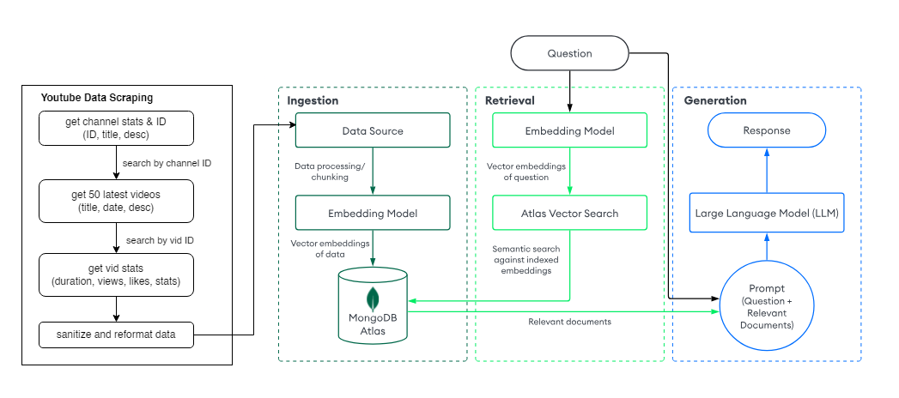

<h1>Youtube Channel Analytics and Comments RAG </h1>

<h3>Core:<h3>

- LLM: Llama3.2 using Ollama and LangChain 
- DB: MongoDB Atlas

 
<h3>Overview</h3>
This project aimed to enable customizable natural language queries for YouTube analytics with sentiment and trend analysis.

By leveraging an LLM and Retrieval-Augmented Generation (RAG) with the YouTube Data API, users can query/perform the questions such as:

- What is the general topic or subject matter of this channel?

- What keywords or phrases are most commonly associated with the channel's content?

- Provide a statistical overview of the content (likes, comments, views, video length, and upload date).

- Summarize the sentiment of the comments for a specific video.

<h3>Analytic Types:</h3>

<h4>1. Provide a youtube channel name (@TED, @RickAstleyYT, etc.) for video analytics on the latest 50 videos </h4>

- Channel analytics include (total subscribers, total view counts, total likes, etc.)

- Video analytics includes (title, description, view count, like count, favorite count, comment count, etc.)

<h4> 2. Provide a youtube video_id to pull the latest comments. </h4>

- Comments are stored independently from the channels.

 
<h4>See YT docs for more information.</h4>

YT Channel Docs: https://developers.google.com/youtube/v3/docs/channels#resource

YT Videos Docs: https://developers.google.com/youtube/v3/docs/videos

YT Comments Docs: https://developers.google.com/youtube/v3/docs/comments

 
<h3>Architecture</h3>

Diagram for channel video analytics flow with a similar flow for comment analytics.
Image modified from MongoDB Docs.

<h3>Files:</h3>

main.py - main code

youtube_fetch.py - calls youtube APIs to fetch data

rag.py - fetches yt data, saves into MongoDB, runs LLM using langchain

config_keys.py - rename to config.py and add API keys
